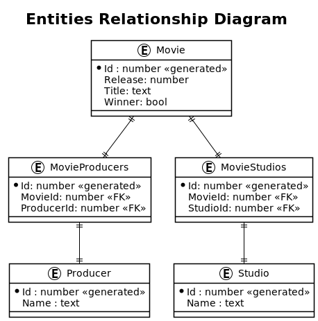
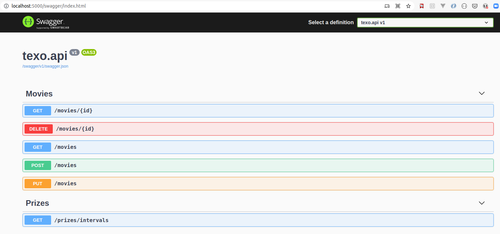
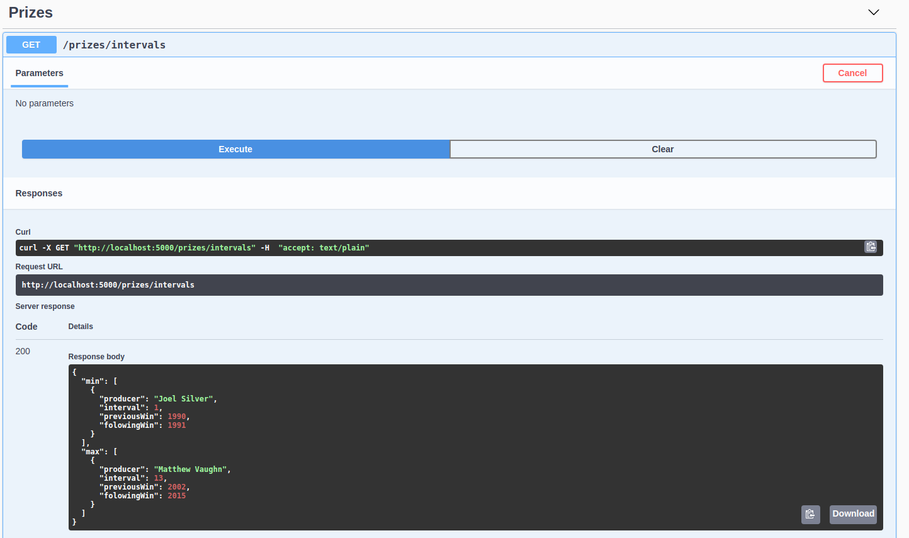

# texo-exercise

[](https://github.com/guionardo/texo-exercise/actions/workflows/dotnet.yml)
[](https://codecov.io/gh/guionardo/texo-exercise)
[](https://github.com/guionardo/texo-exercise/actions/workflows/codeql-analysis.yml)

## Especificação do Teste

Desenvolva uma API RESTful para possibilitar a leitura da lista de indicados e vencedores
da categoria Pior Filme do Golden Raspberry Awards.

## Requisito do sistema:

1. [X] Ler o arquivo CSV dos filmes e inserir os dados em uma base de dados ao iniciar a aplicação.

## Requisitos da API:

1. [x] Obter o produtor com maior intervalo entre dois prêmios consecutivos, e o que obteve dois prêmios mais rápido, seguindo a especificação de formato definida na página 2;

## Requisitos não funcionais do sistema:

1. [x] O web service RESTful deve ser implementado com base no nível 2 de maturidade de Richardson;
2. [x] Devem ser implementados somente testes de integração. Eles devem garantir que os dados obtidos estão de acordo com os dados fornecidos na proposta;
3. [x] O banco de dados deve estar em memória utilizando um SGBD embarcado (por exemplo, H2). Nenhuma instalação externa deve ser necessária;
4. [x] A aplicação deve conter um readme com instruções para rodar o projeto e os testes de integração.
5. [x] O código-fonte deve ser disponibilizado em um repositório git (Github, Gitlab, Bitbucket, etc).

## Formato da API:

### Descrição

Intervalo de prêmios

### Formato
```json
{
 "min": [
 {
 "producer": "Producer 1",
 "interval": 1,
 "previousWin": 2008,
 "followingWin": 2009
 },
 {
 "producer": "Producer 2",
 "interval": 1,
 "previousWin": 2018,
 "followingWin": 2019
 }
 ],
 "max": [
 {
 "producer": "Producer 1",
 "interval": 99,
 "previousWin": 1900,
 "followingWin": 1999
 },
 {
 "producer": "Producer 2",
 "interval": 99,
 "previousWin": 2000,
 "followingWin": 2099
 }
 ]
}
```

## Diagrama de Relacionamento de Entidades



## Instruções

Esta API foi desenvolvida para ser executada em ambiente Linux. Se você está rodando Windows 🙃, bem, você pode usar os comandos alternativos abaixo.


## TESTANDO

```bash
guionardo @ guiosoft ~/dev/github.com/guionardo/texo-exercise (main *=)
└─ $ ▶ /home/guionardo/texo-exercisemake test 
```
```bash
C:\texo-exercise> dotnet test --verbosity normal /p:CollectCoverage=true
```

## EXECUTANDO

```bash
guionardo @ guiosoft ~/dev/github.com/guionardo/texo-exercise (main *=)
└─ $ ▶ make run
```

```bash
C:\texo-exercise> dotnet test --verbosity normal /p:CollectCoverage=true
```

## EXECUTANDO COM DOCKER

```bash
guionardo @ guiosoft ~/dev/github.com/guionardo/texo-exercise (main *=)
└─ $ ▶ make run-docker
```

```bash
C:\texo-exercise> docker-compose up --build
```

## TESTE DE API

Após iniciar o projeto, você poderá acessar a API a partir do seu navegador, no endereço http://localhost:5000/swagger e encontrará a interface OpenAPI (swagger).




## Obtendo os resultados do enunciado do exercício

