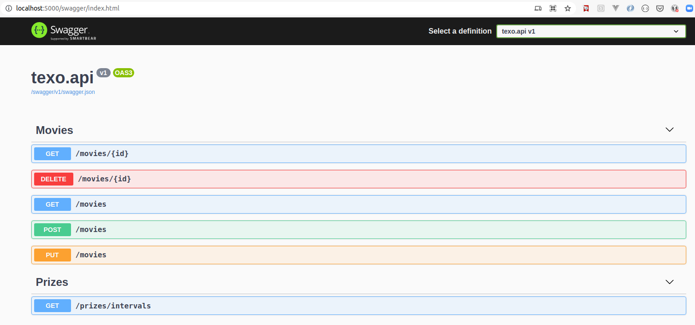

# INSTRUÇÕES

Esta API foi desenvolvida para ser executada em ambiente Linux. Se você está rodando Windows 🙃, bem, você pode usar os comandos alternativos abaixo.


## TESTANDO

```bash
guionardo @ guiosoft ~/dev/github.com/guionardo/texo-exercise (main *=)
└─ $ ▶ /home/guionardo/texo-exercisemake test 
```
```bash
C:\texo-exercise> dotnet test --verbosity normal /p:CollectCoverage=true
```

## EXECUTANDO

```bash
guionardo @ guiosoft ~/dev/github.com/guionardo/texo-exercise (main *=)
└─ $ ▶ make run
```

```bash
C:\texo-exercise> dotnet test --verbosity normal /p:CollectCoverage=true
```

## EXECUTANDO COM DOCKER

```bash
guionardo @ guiosoft ~/dev/github.com/guionardo/texo-exercise (main *=)
└─ $ ▶ make run-docker
```

```bash
C:\texo-exercise> docker-compose up --build
```

## TESTE DE API

Após iniciar o projeto, você poderá acessar a API a partir do seu navegador, no endereço http://localhost:5000/swagger e encontrará a interface OpenAPI (swagger).




## Obtendo os resultados do enunciado do exercício

